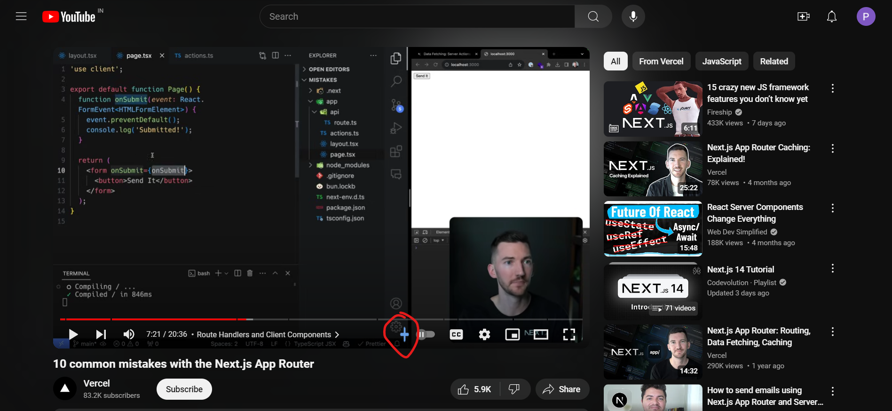
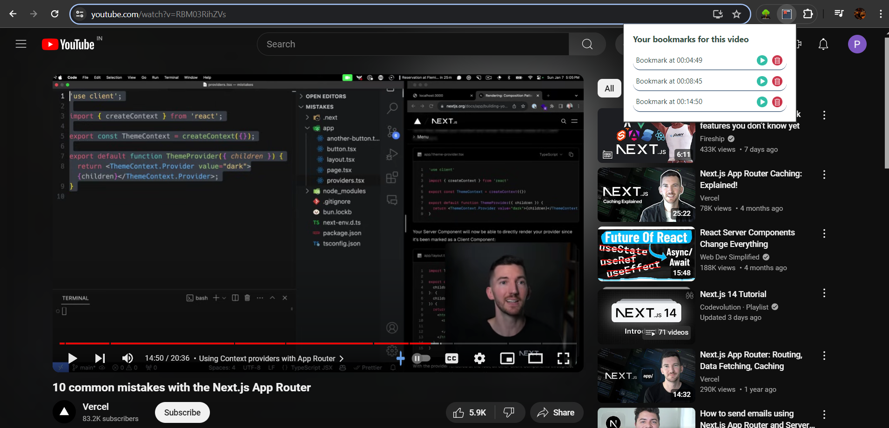

# Bookmark Extension for YouTube Videos

## Overview

The Bookmark Extension for YouTube Videos is a handy tool designed to enhance your video-watching experience. It allows you to create, manage, and navigate through bookmarks on YouTube videos effortlessly.

## Features

- **Add Bookmark**: Easily add a bookmark at your current video timestamp by clicking the "Add" button located below the video progress bar.
- **View Bookmarks**: Access and manage all your bookmarks from the extension tab.
- **Play Bookmarks**: Click the play button next to a bookmark to jump back to the exact moment it was created.
- **Delete Bookmarks**: Remove bookmarks that you no longer need with the delete button.
- **YouTube Only**: The extension only functions when a YouTube video is running. On other websites, it will display a message prompting you to switch to a YouTube video.

## Installation

1. Clone the repo from the https://github.com/prynsh/YT-Extension.
2. Open your browser and navigate to the extensions page (usually found under settings or tools).
3. Enable "Developer mode" (usually a toggle at the top right of the extensions page).
4. Click on "Load unpacked" and select the downloaded extension package folder.
5. The Bookmark Extension for YouTube Videos should now appear in your extensions list.

## Usage

1. **Open a YouTube Video**: Navigate to YouTube and start playing any video.
2. **Add a Bookmark**: Click the "Add" button located right below the video progress bar to add a bookmark at the current timestamp.
3. **Manage Bookmarks**:
    - **View**: Open the extension tab to see all your bookmarks.
    - **Play**: Click the play button next to a bookmark to jump to that timestamp in the video.
    - **Delete**: Click the delete button next to a bookmark to remove it.

## Screenshots

*Add a bookmark by clicking the "Add" button.*

*Manage your bookmarks from the extension tab.*

## Notes

- The extension will display a message "Please switch to a YouTube Video" when you try to use it on websites other than YouTube.
- Ensure the video is playing or paused before attempting to add a bookmark.
